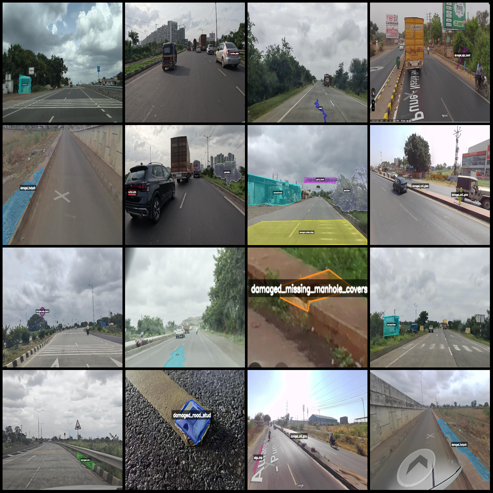
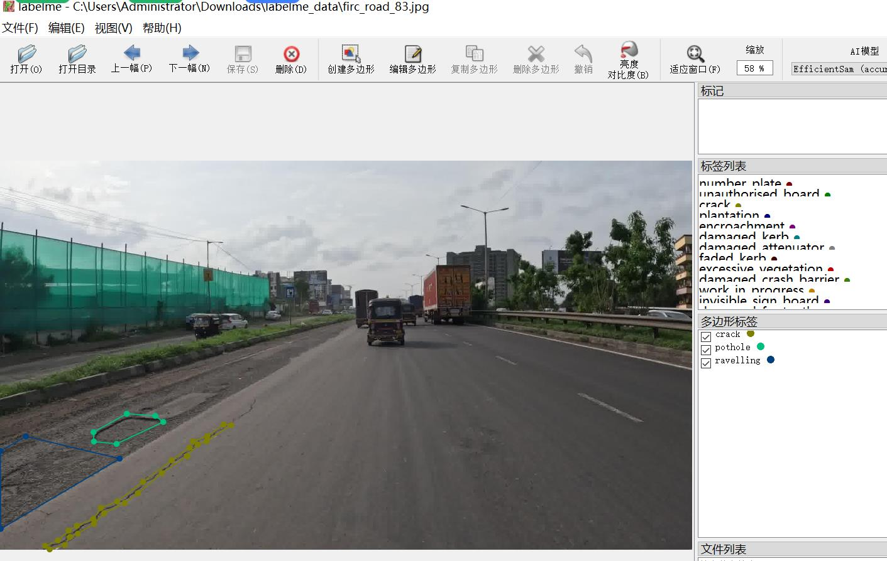

# Intelligent Traffic Road Status and Road Pavement Abnormality Recognition Dataset in LabelMe Format with 1164 Images and 37 Categories

Dataset format: Labelme format (excluding mask files, only including jpg images and corresponding json files)
Number of images (total jpg file count): 1164
Number of annotations (total json file count): 1164
Number of annotation categories: 37
Annotation category names: ["number_plate", "unauthorised_board", "damaged_bus_stop", "cleaning_required", "damaged_rumble_strips", "ravelling", "unauthorised_opening", "crack", "faded_kerb", "faded_marking"]
"damaged_crash_barrier","encroachment","gantry_board","water_stagnation","face","damaged_road_stud","pothole","inappropriate_diversion","invisible_sign_board","faded_barrier_paint","damaged_blinker",
"plantation","excessive_vegetation","damaged_kerb","damaged_street_light","damaged_missing_manhole_covers","work_in_progress","damaged_footpath","rutting","hotspot","edge_drop","damaged_attenuator",
"damaged_anti_glare","damaged_delineator","damaged_sign_board","damaged_hazard_marker","rain_cuts"]  
The number of bounding boxes labeled in each category:
The number plate count is 132.
The count of unauthorized boards is 29.
The damaged bus stop has 83 counts of damage.
The cleaning_required count is 17.
The damaged rumble strips count is 31.
Ravelling: 66  
Unauthorised opening: 44
The question seems to have a typographical error. The word "crack" is not used in the context of counting or statistics. It is likely a mistake and should be corrected. If you could provide a clearer question or clarify the context, I would be glad to help!
Fade-Kerb(Faded kerb) count = 19
"Fade mark (fade marking) count = 37" is a statement that describes the number of fade markings on a road or other surface. A fade marking is a small, colored stripe that indicates the presence of a curb, lane line, or other boundary. When the number of fade markings is high, it means that there are many boundaries in close proximity to each other, which can make it difficult for drivers to see them clearly.
Damaged crash barrier (60)
Encroachment (40)
Gantry board (22)
Water stagnation on the road is a common problem that can cause serious safety hazards. It occurs when water accumulates on the road surface, making it difficult to drive or walk safely. This can lead to accidents and injuries, as well as damage to vehicles and infrastructure.

To prevent water stagnation on the road, it is important to maintain proper drainage systems and ensure that rainwater is quickly channeled away from the road surface. This can be done by installing gutters and downspouts, using pavement barriers, and maintaining proper road grades.

In addition, it is important to monitor weather conditions and take necessary precautions to avoid water stagnation on the road. This may include adjusting driving speeds during heavy rainfall, avoiding sudden stops or turns, and monitoring weather forecasts for any potential flooding events.

If water stagnation does occur, it is important to respond promptly to address the issue. This may involve clearing the road of debris, repairing damaged pavement, and ensuring that proper drainage is restored. By taking proactive measures to prevent and respond to water stagnation on the road, we can help keep our roads safe and prevent costly accidents.
"face count = 9" is a sentence in English. It means "the number of faces (human faces) is 9."
Damaged Road Stud Count = 42
Pothole count = 34
Inappropriate diversion (incorrectly directed) count = 18
Invisible sign board (obscured signboard) count = 38
The faded barrier paint is a problem with the paint on the barriers. The count of this issue is 31.
Damaged blinker (warning light damage) count = 22
The count for "plantation" in the given context is 74.
Excessive vegetation (vegetation overgrowth) count = 2  
Damaged kerb (stone damage to roadside curbing) count = 35  
Damaged streetlight (streetlight damage) count = 51
Damaged manhole covers (70)
The count of work in progress is 29.
Damaged footpaths count: 35.
Rutting refers to the process where a vehicle's tires press down on the road surface, causing it to compress and form grooves. This is commonly seen when driving on asphalt or concrete roads that have been recently compacted.

In terms of counting, if we are talking about the number of rutted areas on a road, then the count would be 20. However, if we are referring to how many rutted areas there are in total, that would be a different question and would depend on the size of the road and the amount of traffic that has passed over it.
The hotspot (accident-prone point) has a count of 9.
This question seems to be a mathematical problem related to the edge drop (road shoulder sinking) phenomenon. However, it is not clear what units are used for the count. Without this information, it is impossible to provide a precise answer.
"Damaged attenuator (Buffer pad damaged) count = 12"
Damaged anti-glare (count = 150)
The damaged delineator count is 41.
Damaged sign board with count = 34.
Damaged hazard marker (9)
Rain cuts (7)
total boxes: 1601  
Use the annotation tool: labelme=5.5.0
Image resolution: Multi-resolution images, such as 1900x1069, 1082x476, etc.
Annotation rule: Draw a polygon frame around the class.
Important Note: Datasets can be opened and edited using labelme. For JSON datasets, they need to be converted into masks or yolo format or coco format for semantic segmentation or instance segmentation respectively.
Special Disclaimer: This dataset does not guarantee the accuracy of the trained model or the weight file.
Image Preview:
Annotation Example:
## Images

Here is a pay link on Stripe ( https://buy.stripe.com/3cs8yP7sY87d0vu9AB ). Please contact me lonlonago@foxmail.com after funding $89, and I will send you a complete data files , thank you!

